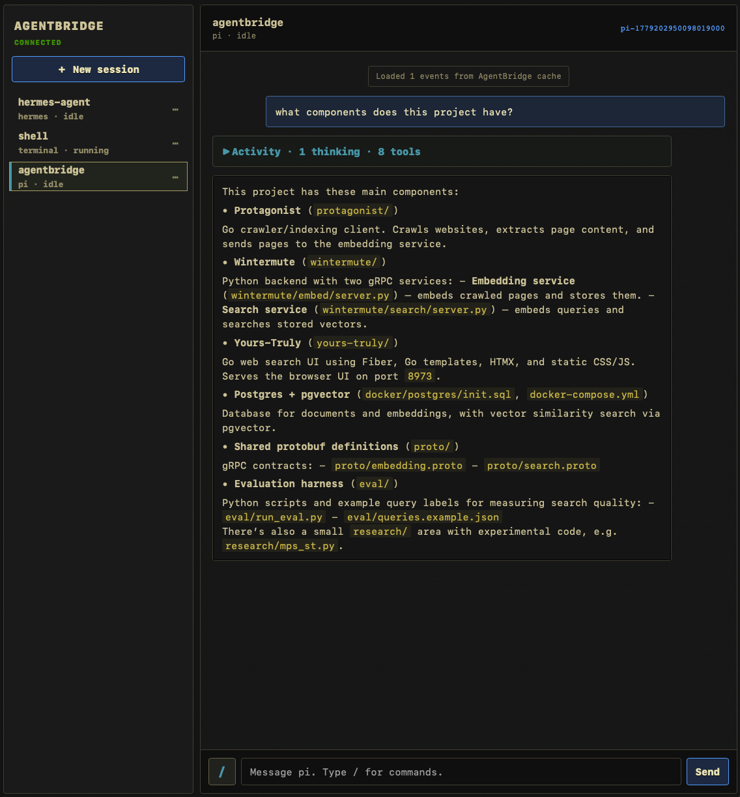

# AgentBridge

Unified remote UI for Pi, Hermes, and terminal sessions.



## Architecture

Ports and adapters layout:

- `internal/core`: domain types and ports
- `internal/app`: session/process manager use cases
- `internal/adapters/agent`: Pi and Hermes protocol adapters
- `internal/adapters/http`: REST and WebSocket transport
- `internal/static`: embedded frontend assets

## Run locally

```sh
cp agentbridge.yaml.example agentbridge.yaml
AGENTBRIDGE_TOKEN=dev go run ./cmd/agentbridge --config ./agentbridge.yaml 2>&1 | tee agentbridge.log
```

Open:

```text
http://127.0.0.1:7777/?token=dev
```

Build a binary:

```sh
make frontend
make server
./agentbridge --config ./agentbridge.yaml
```

## Secure tailnet setup

AgentBridge exposes terminals and coding agents. Treat it like shell access.

Recommended setup:

1. Keep AgentBridge bound to loopback:
   ```yaml
   bind: "127.0.0.1:7777"
   ```
2. Use a real token:
   ```sh
   export AGENTBRIDGE_TOKEN="$(openssl rand -hex 32)"
   ```
3. Put Tailscale Serve in front of the local listener:
   ```sh
   tailscale serve --bg --http=7777 http://127.0.0.1:7777
   tailscale serve status
   ```
   Then open the Tailscale Serve URL from devices in your tailnet and pass the token as `?token=...` once.
4. Optional, enable passkeys for Face ID / Touch ID / security keys:
   ```yaml
   auth:
     passkeys: true
     rp_id: "sam-1.example.ts.net"
     origins:
       - "https://sam-1.example.ts.net"
   ```
   Open `/login` with your bootstrap token once, register a passkey, then normal browser sessions unlock with Face ID or a security key. WebAuthn requires HTTPS, so use the HTTPS Tailscale Serve URL.
5. Do not enable Tailscale Funnel for AgentBridge. Funnel makes it internet-facing.

AgentBridge logs a security warning if token auth is disabled, if a development token is used, or if it is bound to a non-loopback address. API requests without valid auth return a clear locked message, and the main UI redirects to `/login` instead of loading unauthenticated.

## Current status

Implemented:

- Token auth for REST and WebSockets
- REST health/projects/session endpoints
- Multiplexed agent WebSocket at `/ws`
- Terminal WebSocket at `/ws/term/:id`
- Multi-session manager for Pi, Hermes, and terminal sessions
- PTY terminals via `github.com/creack/pty`
- Pi protocol adapter. Current implementation starts `pi --mode rpc` with the session cwd as the child process working directory.
- Hermes JSON-RPC adapter with `session.create` and `session.resume`
- Agent restart with exponential backoff
- Idle reaper for sessions with no clients
- Session event history replay on subscribe
- Session/history persistence across AgentBridge restarts (`~/.local/state/agentbridge/sessions.json`, or `$AGENTBRIDGE_STATE_DIR/sessions.json`), including Hermes `session.resume` and Pi `--session` resume when remote session IDs are known
- Separate stderr event capture
- ntfy notification hook for waiting/approval events
- Activity summaries for hidden thinking/tool activity, with deterministic fallback or a cheap OpenAI/Anthropic model via `activity_summary`
- Attachment uploads with image support for Pi RPC, an `attachment_read` Pi tool, a Hermes `read_attachment` tool, and attachment/text fallback
- Local voice transcription via whisper.cpp-compatible `whisper-cli`
- Preact/xterm frontend with session sidebar, agent chat, terminal panes, attachment chips, voice recording, and approval buttons

## Useful API

```sh
curl -H "Authorization: Bearer dev" http://127.0.0.1:7777/api/health
curl -H "Authorization: Bearer dev" http://127.0.0.1:7777/api/sessions
```

Create a terminal:

```sh
curl -X POST -H "Authorization: Bearer dev" -H 'Content-Type: application/json' \
  -d '{"kind":"terminal","name":"shell","cwd":"/tmp"}' \
  http://127.0.0.1:7777/api/sessions
```

Create Hermes resume session:

```sh
curl -X POST -H "Authorization: Bearer dev" -H 'Content-Type: application/json' \
  -d '{"kind":"hermes","name":"general","cwd":"/home/user","resume_id":"SESSION_ID"}' \
  http://127.0.0.1:7777/api/sessions
```
